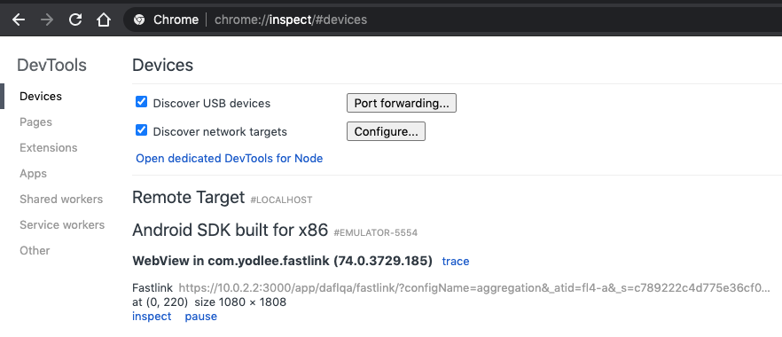

# FastLink - Android(Java)

This Sample App demostrates the steps, you need to follow to Integrate the FastLink Application in the Android WebView

## Getting Started

FastLink uses the Client Credentials authentication mechanism. You need to pass the valid AccessToken while authenticating the FastLink Application. You can find more information regarding this in <a href="https://developer.yodlee.com/docs/api/1.1/getting-started-with-cc" _blank>Getting started with Client Credentials</a> link.

### How to run the Project

Follow the steps below to run the project in your system:

Step 1: Open the project in Android Studio

Step 2: Open the Config.java file and update the `fastlinkURL` constant.

Step 3: Run the application in Emulator/Connected device

### Sample App Details

This app has the three views.

-   LoginActivity

    Where you can update the FastLink URL, Access Token and modify the extra params which needs to be passed.

-   WebViewActivity

    In this view WebView instance is been created and FastLink is loaded in the WebView

-   EventsInfoActivity

    This view shows the all Native events which are sent from FastLink to native.

## FAQ

<b>How to debug the Application in Chrome Browser?</b>

To debugg the FastLink you need to enable the following setting in the WebView

<code>
WebView.setWebContentsDebuggingEnabled(true);
</code>

Open the following url in the Chrome browser:

<code>
chrome://inspect
</code>

This will show the following view the chrome, click on the inspect link and this will open the chrome developer tools to debug the application.

  

> Note:
> We have provided a sample code for integrating FastLink in WebView for testing purpose only. This is not production ready code.
