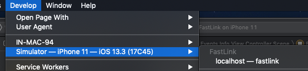

# FastLink - iOS(Swift)

This Sample App demostrates the steps, you need to follow to Integrate the FastLink Application in the iOS WebView

## Getting Started

FastLink uses the Client Credentials authentication mechanism. You need to pass the valid AccessToken while authenticating the FastLink Application. You can find more information regarding this in <a href="https://developer.yodlee.com/docs/api/1.1/getting-started-with-cc" _blank>Getting started with Client Credentials</a> link.

### How to run the Project

Follow the following steps to run the project in your system:

Step 1: Open the project in XCode

Step 2: Open the Config.plist file and update the `FastLinkURL` constant.

Step 3: Run the application in simulator/Connected device

### Sample App Details

This app has the three views.

-   LoginViewController

    Where you can update the FastLink URL, Access Token and modify the extra params which needs to be passed.

-   FastLinkViewController

    In this view WebView instance is been created and FastLink is loaded in the WebView

-   EventsInfoViewController

    This view shows the all Native events which are sent from FastLink to native.

## FAQ

<b>How to debug the Application in Safari Browser?</b>

To debug the WebView App should run in the Debug target. Open the Safari in your system and then in the 'Develop' menu select the connected device/Simulator.

  

This will show the url to debug the application.

> Note:
> We have provided a sample code for integrating FastLink in WebView for testing purpose only. This is not production ready code.
